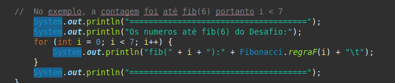
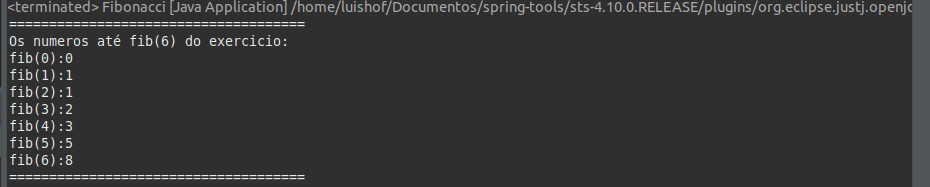

# Desafio de Lógica de Programação

Faça um algoritmo que calcule a sequência de Fibonacci.

Lembrando que Fibonacci é uma sequência de números inteiros, começando normalmente por 0 e 1, na qual, cada termo subsequente (número de Fibonacci) corresponde a soma dos dois anteriores.

A sequência é definida pela fórmula abaixo.

Os primeiros números desta sequência seriam: 1, 1, 2, 3, 5, 8, 13, 21, 34, 55, 89, 144, 233, 377...

Então, podemos utilizar como testes os resultados abaixo.

- fib(0) == 0
- fib(1) == 1
- fib(2) == 1
- fib(3) == 2
- fib(4) == 3
- fib(5) == 5
- fib(6) == 8

<h3> Desafio realizado no Spring Tool Suite </h3>

Linguagem utilizada Java.

